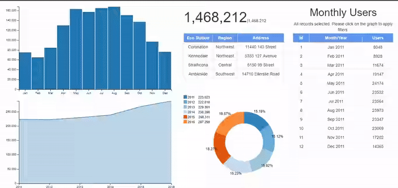

# Eco Station Users Monthly Dashboard

# Dashboard Summary
Uses data acquired from [Open Data(City of Edmonton)](https://dashboard.edmonton.ca/Dashboard/Eco-Station-Users-Monthly/2zer-fm7k) to analyze the yealry and monthly trend of Eco Station users. Users can filter by month or by year to view desired trends. 2017 data in not included it is incomplete. 72 rows are selected out of the 80 rows.

The frameworks used for making the dashboard include:
[crossfilter.js](http://square.github.io/crossfilter/), [dc.js](https://dc-js.github.io/dc.js/), [d3.js](https://d3js.org/), and [bootstrap.js](https://getbootstrap.com/docs/3.3/javascript/)

[***Eco Station Dashbord Click Me***](https://mikelotis.github.io/Edmonton-Eco-Stations/)

# Features
Only the location table isn't variable(doesn't update when filters are applied).The Components of the dashboard resize when the window is resized. The dashboard constitutes of the following:
## Bar chart
Clickable bars, elastic y axis and bars, and mouse hover for the bars
* Shows monthly trend when not filtered(clicked)
* Mouser hover shows corresponding month and number of users
* When filtered the line chart(yearly trend), pie chart(yearly composition) and data table update accordingly to show filtered data
## Pie Chart
Clickable slices and legend rectangles, and mouse hover for the slices and legend rectangles
* Shows yearly composition when not filtered(clicked)
* The legend total data updates to correspond to bar chart filters
* Mouser hover shows corresponding year and percentage for the year
* When filtered the bar chart(monthly trend) and data table update accordingly to show filtered data
## Line Chart
Elastic y axis, mouse hover on line and non-clickable
* Shows the total yearly trend when bar chart is not filtered
* Updates to show yearly trend for month or months when bar chart is filtered
## Location Table
Non-clickable and static table
* Shows the locations of Eco Stations within Edmonton
## Number Display
Non clickable and dynamic number text
* Shows overall total number of Eco Station users when no filters are applied
* Updates to show the sum of users corresponding to filter and filters applied
## Data Table
Non-clickable and dynamic table
* Set to show only 12 months of the 72 months
* Updates to show corresponding filtered data

